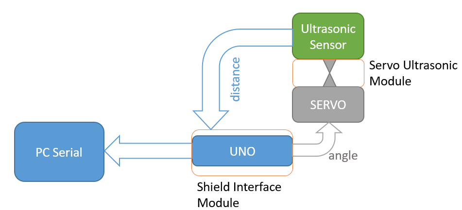
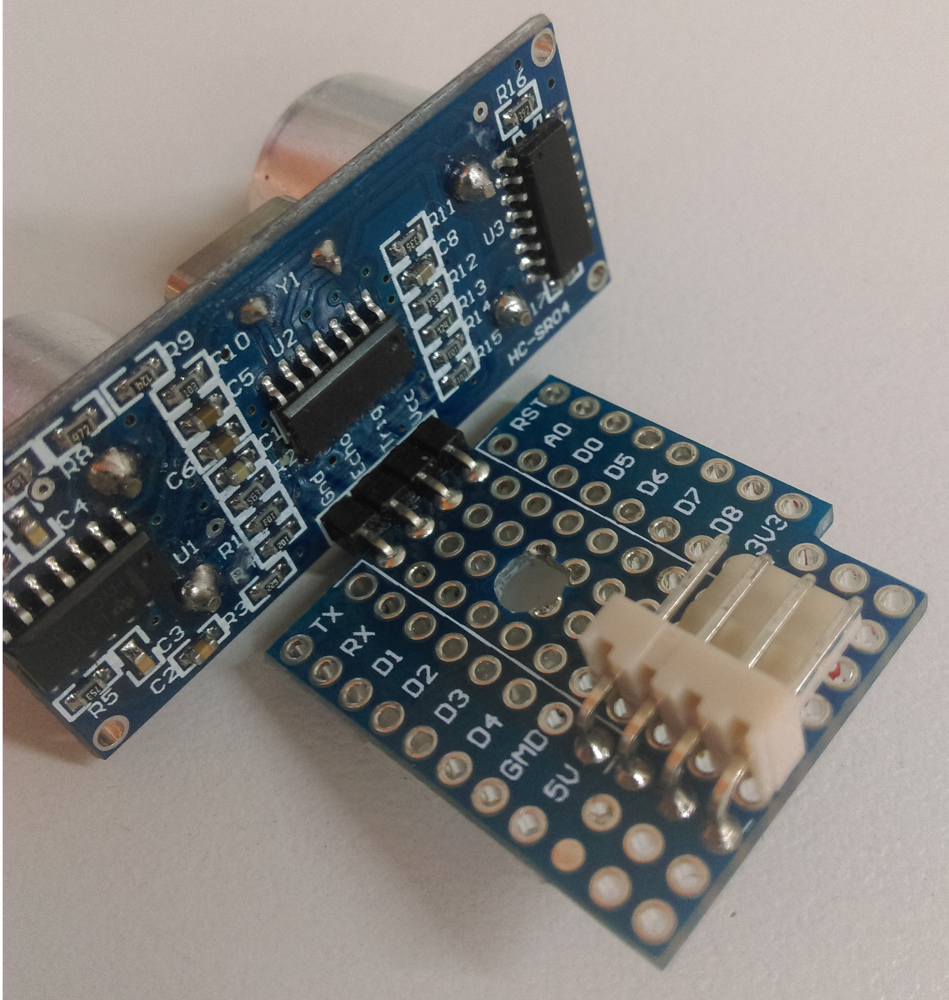
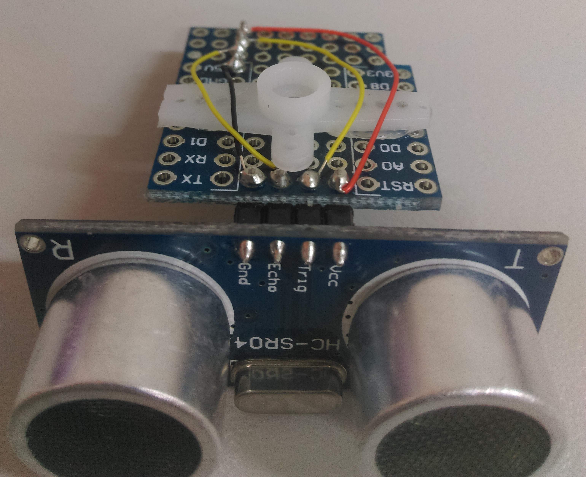
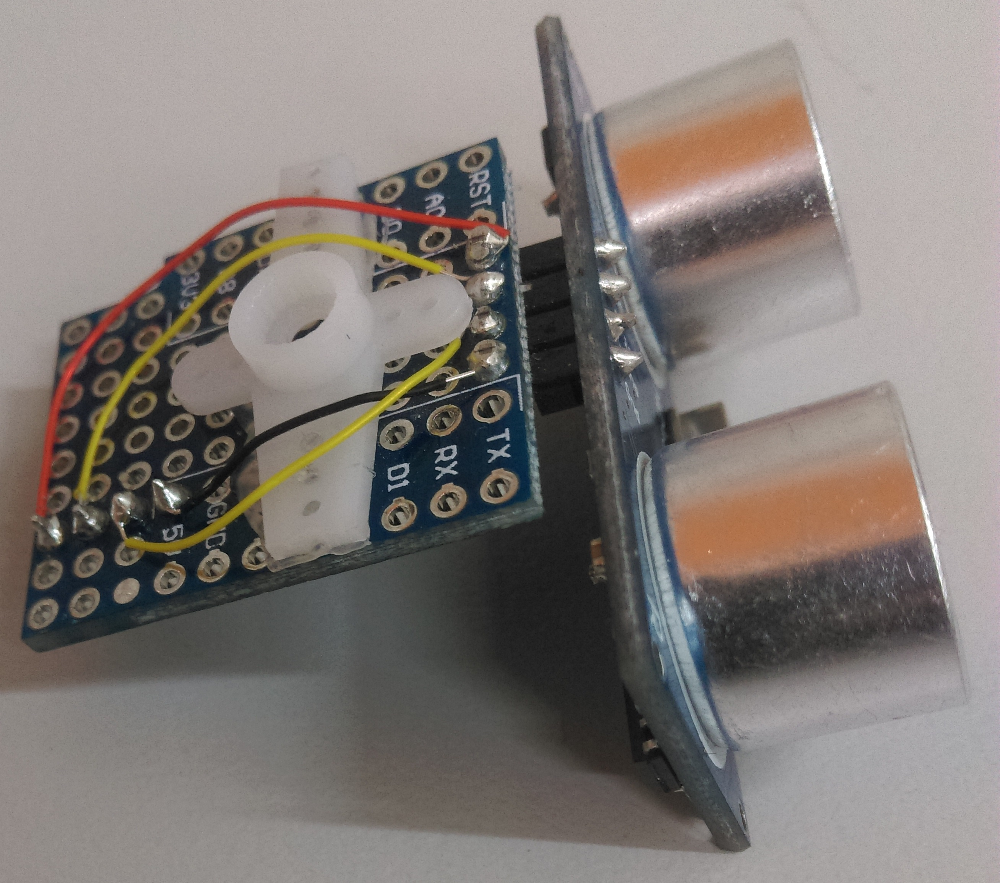
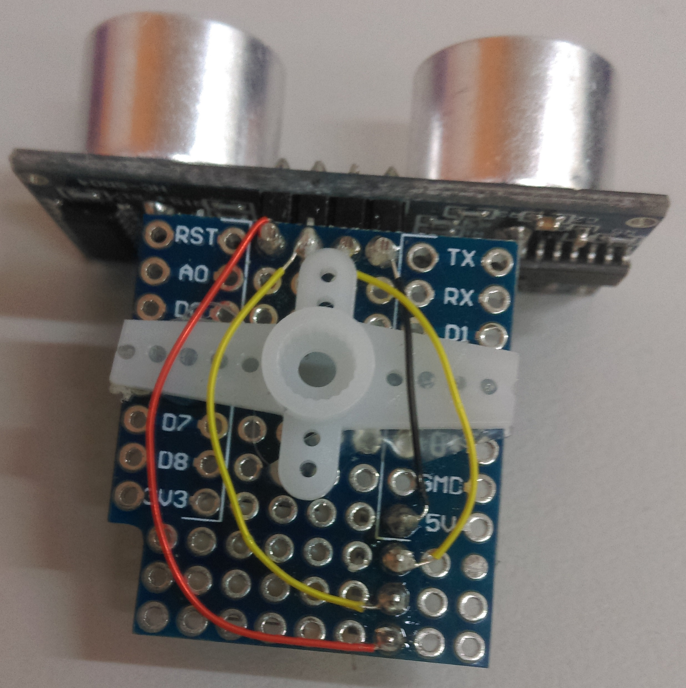
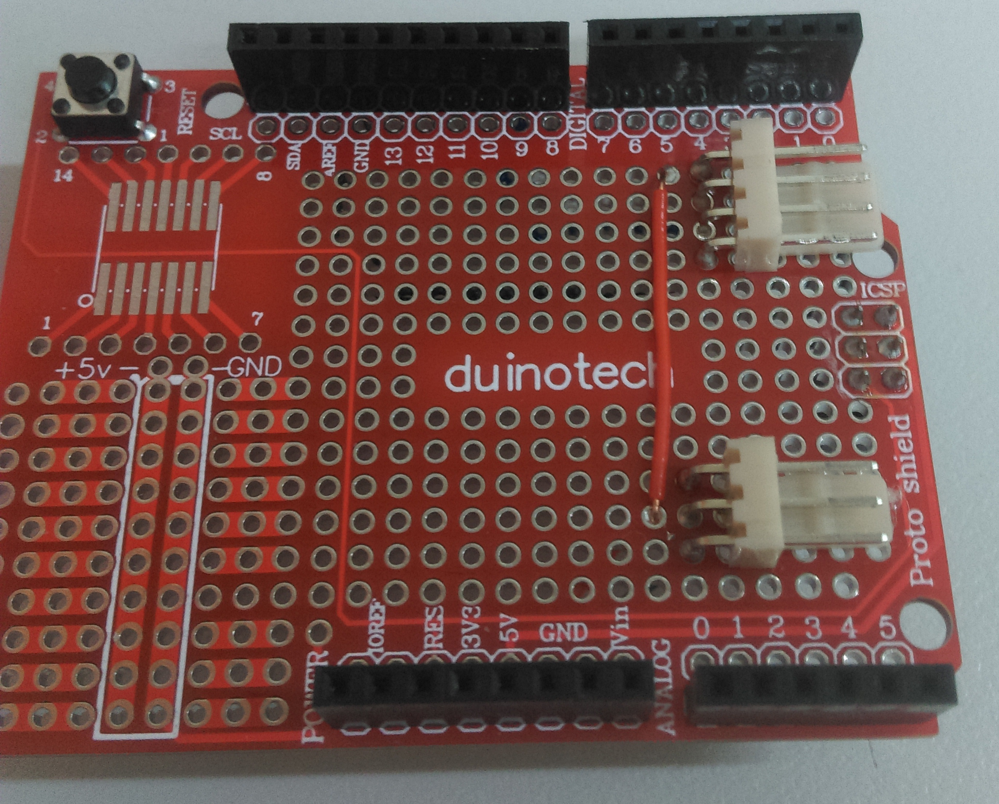
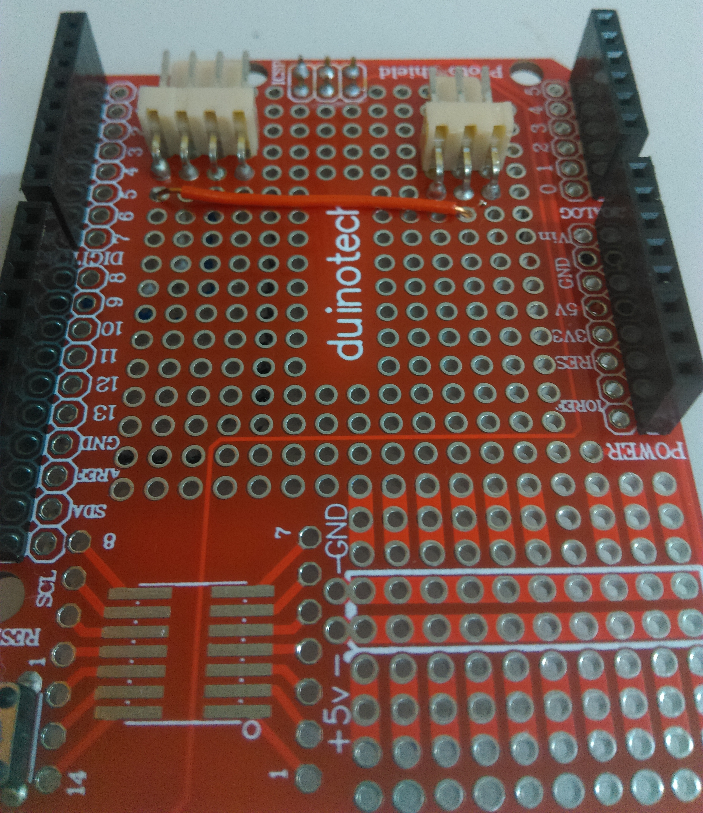
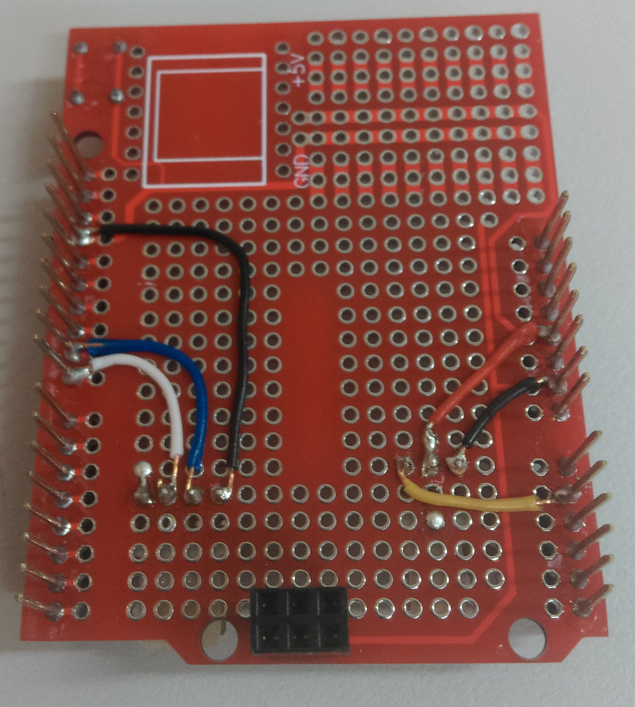
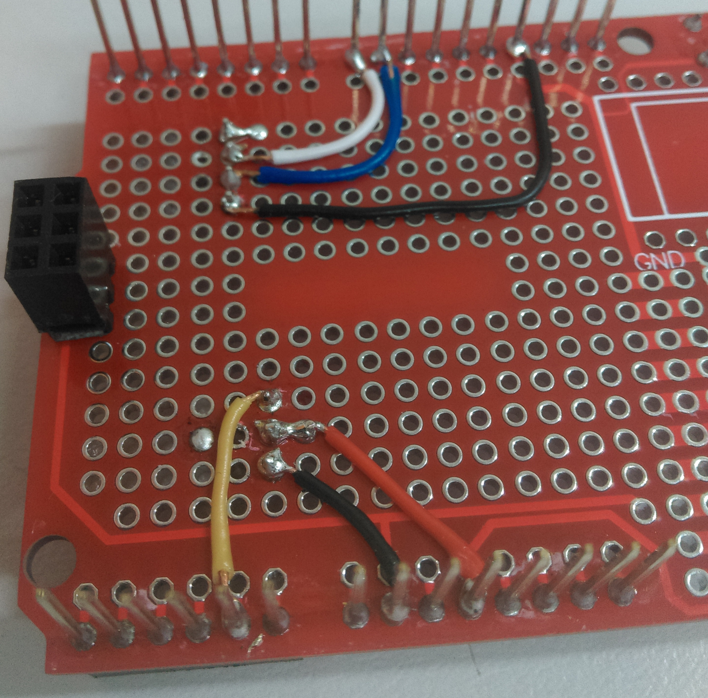

# Ultrasonic Radar

Watch a cool raadar slide across your computer screen like the old time war-movies! Use the simple ultrasonic sensor to measure distance in a rotating fashion across your work bench.

Uses Arduino to make the radar and Processing gui to display on your computer.

| Input | Output | 
| ----- | ------ | 
| Distance | Serial Data |

<!-- TOC -->

- [Ultrasonic Radar](#ultrasonic-radar)
    - [Bill of materials](#bill-of-materials)
    - [Software & Libraries](#software--libraries)
    - [System overview](#system-overview)
        - [Servo Ultrasonic module Assembly](#servo-ultrasonic-module-assembly)
        - [Shield Interface module Assembly](#shield-interface-module-assembly)
    - [Integration](#integration)
    - [Use](#use)
    - [Future improvements](#future-improvements)
    - [Further reading](#further-reading)

<!-- /TOC -->

## Bill of materials 

| Qty | Code | Description | 
| --- | ---- | ----------- | 
|  1  | [XC4410](https://jaycar.com.au/p/XC4410) | arduino uno 
|  1  | [XC4482](https://jaycar.com.au/p/XC4482) | prototyping shield
|  1  | [YM2758](https://jaycar.com.au/p/YM2758) | micro servo
|  1  | [XC4442](https://jaycar.com.au/p/XC4442) | ultrasonic sensor
|  1  | [WC6026](https://jaycar.com.au/p/WC6026) | socket-socket leads
|  1  | [XC3850](https://jaycar.com.au/p/XC3850) | esp8266 prototyping shield
|  2  | [HM3424](https://jaycar.com.au/p/HM3424) | 4 pin locking header
|  1  | [HM3423](https://jaycar.com.au/p/HM3423) | 3 pin locking header

## Software & Libraries

This project will need the Processing program to build the gui. 
You can download processing from here:

https://processing.org/

## System overview 

The overal system is easy enough to understand; There is only 2 main modules and a computer system. 

The SERVO motor will turn the ultrasonic sensor around a range of angles to get distances at those angles; then that will be fed back through the UNO into the computer system.

We use a XC4482 as a base for creating our servo/ultrasonic interface, as well as a smaller prototyping shield to provide a physical hardware mounting between the SERVO and ultrasonic sensor.

### Servo Ultrasonic module Assembly
To make the ultrasonic sensor fit on the servo easily, we can use the small XC3850 prototyping board as a base to put the ultrasonic sensor.

Notice in the picture above that there is a small hole drilled, around the centre of the board. This is to allow the servo screw to fit in and mount the servo arm to the servo. 

It is generally easier to drill this hole out first, then solder the ultrasonic sensor into the board as shown. 

Then it is just a case of soldering some wires to the 4 pins of the ultrasonic sensor, and hot-glueing one of the servo arms to the board so that it can be attached to the servo.

We used wire-wrap wire ( [WW4346](https://jaycar.com.au/p/WW4346) etc) for the small connections but you can use any wire that you have available; Make sure that they do not get in the way of the servo arm. 

Take special consideration of what pins match where, as you need to be sure when you are connecting the ultrasonic to the arduino.

### Shield Interface module Assembly

The shield interface is pretty simple to understand, it simply connects the servo (3 pin) and ultrasonic (4 pin) to the arduino. 

We position the header connectors close to the edge of the board so that there's plenty of room for the cables to move.

On the underside, we just wire it soso that the servo control pin is `A1` and the Ultrasonic pins are connected to pins `8` and `9`. We also use a jumper wire from one header connector to the other to join up the VCC connections; then join the GND connection to the GND on the arduino. 

Doing it in this order makes it so that the socket socket leads can remain together and run neatly next to each other, without tangling VCC/GND/DATA lines. 

## Integration
<!-- How to join it all together -->
Attach the Servo module to the servo, and rotate to check the correct positioning of the servo module. The servo is non-continous, so you will have to check and reposition the ultrasonic sensor if you find that it can not turn in the full range of motion expected.

Then once it is in place and able to turn the range that you need, screw it into the servo through the screwhole. 

Position where it needs to be, and put the shield ontop of the arudino. double check where the wiring is connecting to when you connect both the servo and ultrasonic sensors to the shield. You need to make sure VCC is going to 5V on the arduino, and GND is connected to ground, for both modules.

Then connect to arduino and load the code, you should be able to press upload and see the servo begin to rotate.

## Use

Once the radar is activated you only need to open up the processing IDE,load up the gui code, and press run. 

The Processing GUI will connect to the last Serial port on your computer, which should be the Arduino. 

You will not be able to connect to the Arduino via Processing if you have the Arduino Serial Monitor or Serial Plotter open. Close these and try to run the Processing sketch again. 

## Future improvements 

Got more ideas with what we can add to it? Submit a github issue and get collaborating! 

## Further reading
Please note, Jaycar does not support nor endorse any of the below links, nor offers any guarentee of their quality or suitability for your needs.

* https://www.sciencebuddies.org/science-fair-projects/references/introduction-to-servo-motors
* https://www.servocity.com/how-does-a-servo-work
* https://randomnerdtutorials.com/complete-guide-for-ultrasonic-sensor-hc-sr04/
* https://cdn.sparkfun.com/datasheets/Sensors/Proximity/HCSR04.pdf
